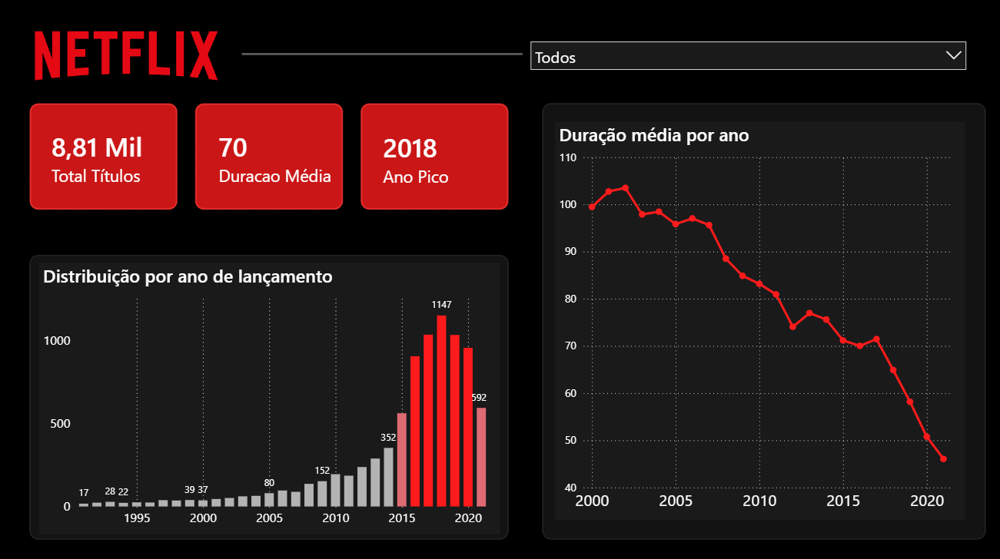
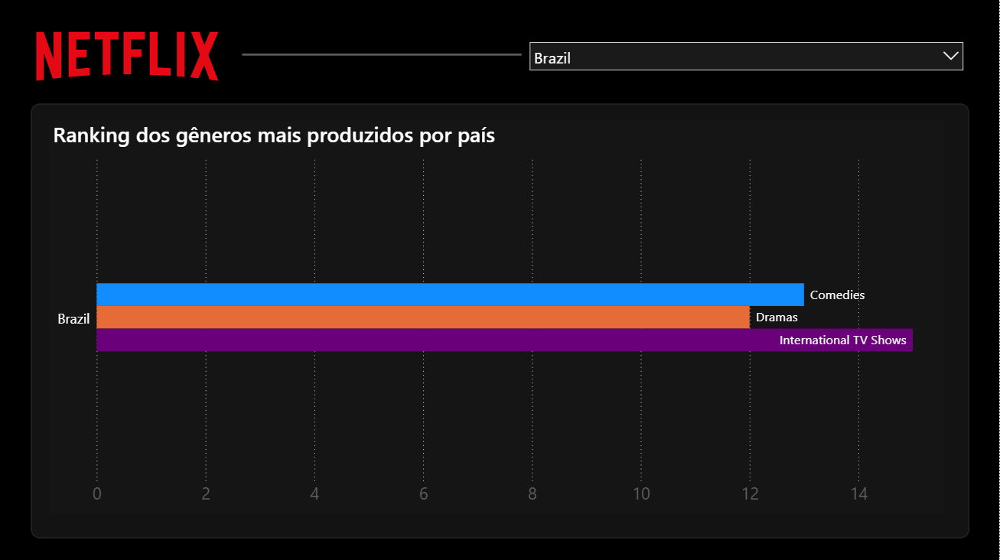
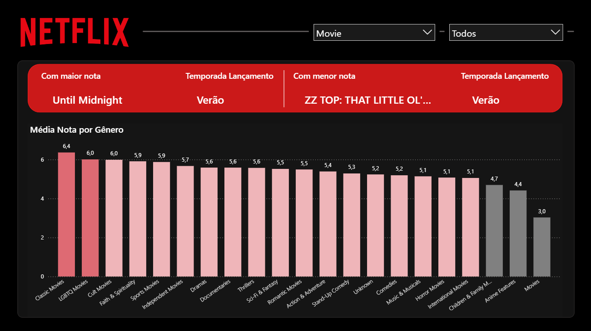

# 🎬 Netflix Movies and TV Shows

## 👩‍💻 Autoras

- [Alana Sampaio](https://github.com/AlanaSampaio)
- [Ana Beatriz](https://github.com/AnaBeCosta)
- [Isabela Menezes](https://github.com/isabelamenezs)
- [Nicoli Belem](https://github.com/nicolibelem)
- [Vitória Cássia](https://github.com/vitoriaa-c)
- [Danielle Moreira](https://github.com/suri0702)

## 📌 O que ele faz

Este projeto implementa um processo completo de ETL (Extração, Transformação e Carga) com dados da Netflix, desde a definição do problema até a preparação dos dados para análise em Business Intelligence.

O diferencial do projeto está em cobrir todo o ciclo de dados:

Definição estratégica (MVP)
Curadoria e governança de dados
Engenharia de dados (Python + SQL)
Pipeline automatizado com Prefect
Geração de insights para tomada de decisão

## 👉 O objetivo principal é responder:

"Quais gêneros a Netflix deve investir em 2026 para aumentar a retenção?"

📊 Link do Power BI: (https://drive.google.com/file/d/1D_AUQ1OYFoRvFuCEpgBXEdl1OfNoXbRX/view?usp=sharing)

## 📊 Dashboard

  

  

  

## 📊 Visão Geral do Projeto

O projeto foi desenvolvido com base em um dataset público da Netflix, contendo informações sobre filmes e séries disponíveis na plataforma.

Além da análise, houve uma forte preocupação com:
- Qualidade dos dados  
- Padronização  
- Reprodutibilidade do processo  

---

## 🧩 Etapas do Projeto

### 🔹 1. Definição do MVP

📄 Documento completo:  
https://docs.google.com/document/d/15Uwo6B1iXwxZV2Yh0wBN8y4Wv0suOay5r6hIriFOxH0/edit?usp=drive_link

---

### 🔹 2. Diagnóstico e Governança de Dados

📄 Plano de curadoria:  
https://docs.google.com/document/d/1yFpWB-g9_H6ObeNEOdifGj4j8Ho6kspQ-Q72OTnUJCo/edit?usp=drive_link

---

### 🔹 3. Manipulação e Análise Estatística

📊 Análise no Google Sheets:  
https://docs.google.com/spreadsheets/d/1MYzaw-E5eh5lqt9PPYVta2Itw6cDTUqYLowsz7LvMd0/edit?usp=drive_link

---

### 🔹 4. Engenharia de Dados com SQL

- Criação de banco SQLite  
- Queries com CTE  
- Ranking de gêneros por país  

---

### 🔹 5. Pipeline ETL com Python (Prefect)

- Tratamento de dados  
- Criação de features  
- Automação com `@flow` e `@task`  
- Logging  

---

### 🔹 6. Visualização de Dados (Power BI)

- Dashboard analítico  
- Insights sobre:
  - Gêneros  
  - Duração  
  - Público  

---

### 🔹 7. Storytelling e Insights

- Identificação de padrões  
- Recomendações estratégicas  

---

## ✨ Funcionalidades

- Leitura de CSV e Excel  
- Limpeza e transformação de dados  
- Engenharia de features  
- Queries SQL avançadas  
- Pipeline automatizado  
- Exportação para BI

---

## 🚀 Resultado Final

📊 Dados estruturados

📈 Insights estratégicos

🎯 Suporte à decisão

⚙️ Pipeline automatizado

---

## 🧠 Tecnologias Utilizadas

Python

Pandas

SQLite

Prefect

Matplotlib / Seaborn

Power BI
